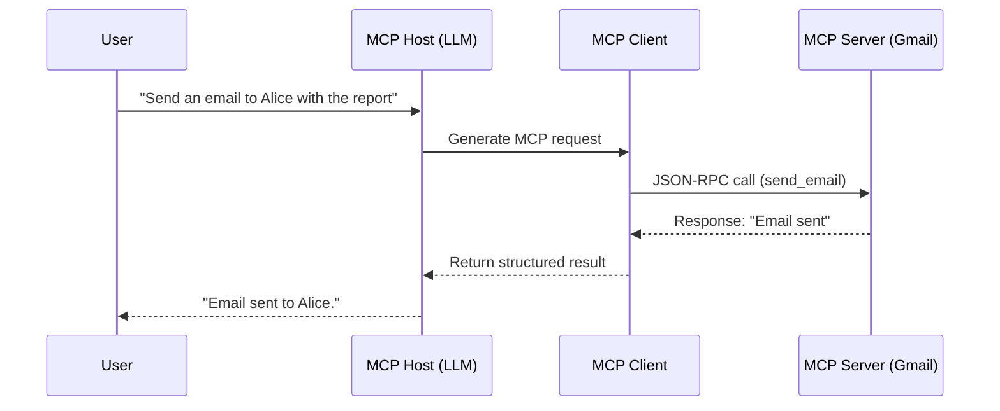

# 📩 Example: Using MCP with Gmail

This example shows how the **Model Context Protocol (MCP)** works in practice — connecting an **LLM (host)** with an external **tool (server)** such as **Gmail** through an **MCP client**.

---

## 🧠 Scenario

You’re using ChatGPT (the **MCP Host**) and say:

> “Send an email to Alice with the report attached.”

Behind the scenes, this request travels through the **MCP stack** like this:

1. **MCP Host (LLM):**  
   Understands your intent and prepares to perform an external action.

2. **MCP Client:**  
   Converts that intent into a **structured MCP request** the tool can understand.

3. **MCP Server (Gmail):**  
   Receives the request, executes it (sending the email), and returns a response.

---

## 🔄 Data Flow



## 🧰 Example MCP Request

The **MCP Client** might send a request like this:

```json
{
  "type": "request",
  "tool": "gmail",
  "method": "send_email",
  "params": {
    "to": "alice@example.com",
    "subject": "Monthly Report",
    "body": "Hi Alice, see attached."
  }
}
```
And the MCP Server could respond with:
```json
{
  "type": "response",
  "status": "success",
  "message": "Email sent successfully."
}
```

## 🔍 Summary

| Component | Role | Example |
|------------|------|----------|
| **MCP Host** | Runs the model | ChatGPT / OpenAI API |
| **MCP Client** | Translates requests | OpenAI’s internal connector |
| **MCP Server** | Executes tasks | Gmail API wrapped in MCP interface |
| **Purpose** | Standardize communication between LLMs and tools | Send email, fetch data, trigger workflows |
