# In-Depth Example: Using MCP with Gmail 📩 

Now that we have looked at a few use cases and a high-level overview of MCP, let's dive into a **detailed, technical example** showing how an LLM communicates with Gmail via MCP.

This example demonstrates how MCP works **end-to-end**, including how an LLM translates a user request into an actionable request for Gmail, and how the server executes it.

---

## A Quick Note on JSON-RPC

Before diving deeper, it helps to understand the format that powers most MCP communications: **JSON-RPC**.

It’s a lightweight, standardized way for two systems to talk — one sends a **request** (usually containing a `method` and some `params`), and the other sends back a **response** (with either a `result` or an `error`).

Think of it as a **common language for function calls over JSON** — no custom API formats, just a consistent structure every time.

---

??? "Example Request"
    ```json
    {
      "jsonrpc": "2.0",
      "id": "42",
      "method": "send_email",
      "params": {
        "to": "alice@example.com",
        "subject": "Hello",
        "body": "How are you?"
      }
    }
    ```

---

## Scenario

User says:

> “Send an email to Alice with the report attached.”

!!! example "LLM connects to Gmail tool using MCP"
    Email gets sent.

User gets back a response:

> "Done! I have sent the email to Alice using your gmail account."

---

## Detailed Data Flow

```mermaid
sequenceDiagram
  participant U as User
  participant H as MCP Host (LLM)
  participant C as MCP Client
  participant S as MCP Server
  participant G as Gmail API
  U->>H: "Send an email to Alice with report attached"
  H->>C: Ask available tools (get_capabilities)
  C->>S: Request list of tools
  S-->>C: Returns available tools (e.g. gmail.send_email)
  C-->>H: Tool metadata returned
  H->>H: Parse intent → identify action & parameters
  H->>C: MCP request JSON (tool: gmail, method: send_email, params {...})
  C->>S: Send JSON-RPC request
  S->>G: Map MCP → Gmail API call (POST /messages/send)
  G-->>S: Gmail HTTP Response (200 OK / error)
  S->>C: Convert Gmail response → MCP JSON-RPC response
  C->>H: Return structured result
  H->>U: "Email sent successfully."
```



---

## End to end journey of the request

We want to show **everything that happens behind the scenes**:

??? "0. **Tool Discovery (Handshake)**"
    - Before doing anything, the **MCP Host** (LLM) asks the **MCP Client** what tools are available.  
    - The Client calls `get_capabilities` on the **MCP Server**.  
    - The Server responds with a list of tools (e.g. `gmail.send_email`, `calendar.create_event`) and their input schemas.  
    - The Host stores this so it knows *what’s possible* before interpreting user intent.  

??? "1. **Intent Parsing (MCP Host / LLM)**"
    - LLM interprets natural language query.  
    - Identifies **action** (`send_email`) and **parameters** (`to`, `subject`, `body`).  
    - Produces a **structured intermediate representation** for MCP Client.

??? "2. **MCP Client Translation**"
    - Converts LLM intent into **MCP JSON-RPC format**.  
    - Handles data validation (email addresses, attachment size).  
    - Ensures it conforms to MCP standard (tool name, method, params).  

??? "3. **MCP Server Execution**"
    - Receives JSON-RPC request.  
    - Maps MCP method to **Gmail API endpoints**.  
        - e.g., `send_email` → `POST https://gmail.googleapis.com/gmail/v1/users/me/messages/send`  
    - Handles authentication / OAuth tokens.  
    - Formats body and attachments according to Gmail API.  
    - Sends request, receives HTTP response, converts it back into MCP response format.  

??? "4. **MCP Response Handling**"
    - MCP Client receives server response.  
    - Converts it into a structured result understandable by the LLM.  
    - LLM generates a human-readable confirmation for the user.

---

## Step 0: Tool Discovery (Handshake)

Before any request is made, the **MCP Client** asks the **MCP Server** what tools and methods are available.

??? example "Capability Discovery Request"
    ```json
    {
      "jsonrpc": "2.0",
      "id": "cap_001",
      "method": "get_capabilities"
    }
    ```

??? example "Capability Discovery Response"
    ```json
    {
      "jsonrpc": "2.0",
      "id": "cap_001",
      "result": {
        "tools": [
          {
            "name": "gmail",
            "methods": ["send_email", "list_threads", "read_message"]
          }
        ]
      }
    }
    ```

🟨 *This handshake allows the host (LLM) to know which tools exist and what parameters each supports.*

---

## Step 1: Intent Parsing (MCP Host / LLM)

The **LLM (Host)** interprets the user’s natural language and converts it into a structured intent.

> “Send an email to Alice with the report attached.”

??? "LLM output (conceptually)"
    ```json
    {
      "tool": "gmail",
      "method": "send_email",
      "params": {
        "to": "alice@example.com",
        "subject": "Monthly Report",
        "body": "Hi Alice, see attached.",
        "attachments": ["report.pdf"]
      }
    }
    ```
> This prepares the request for translation into the MCP JSON-RPC standard.

## Step 2 — MCP Client Translation

The **MCP Client** now converts the LLM’s structured intent into a standardized **MCP JSON-RPC** request that any MCP-compliant server can understand.

??? example "MCP Request (JSON-RPC)"
    ```json
    {
      "jsonrpc": "2.0",
      "id": "req_001",
      "method": "send_email",
      "tool": "gmail",
      "params": {
        "to": "alice@example.com",
        "subject": "Monthly Report",
        "body": "Hi Alice, see attached.",
        "attachments": [
          {
            "filename": "report.pdf",
            "content_base64": "JVBERi0xLjQKJc..."
          }
        ]
      }
    }
    ```

**Key points:**
- `jsonrpc: "2.0"` → standard JSON-RPC 2.0 format.
- `id` → unique request ID for matching responses.
- Attachments are Base64 encoded.
- MCP Client ensures all fields conform to the tool schema.

> *This JSON is now portable — any MCP-compliant server can interpret it.*

---

## Step 3 — MCP Server Execution

The **MCP Server** receives the standardized request, maps it to the appropriate tool API (in this case, Gmail), and performs the action.

??? example "Gmail API Call (POST)"
    ```http
    POST /gmail/v1/users/me/messages/send
    Authorization: Bearer <OAuthToken>
    Content-Type: application/json

    {
      "raw": "<Base64 encoded MIME email including attachment>"
    }
    ```

**Server responsibilities:**
- Map the MCP method (`send_email`) to a real API endpoint (`POST /messages/send`).
- Handle authentication (OAuth tokens).
- Convert MCP JSON → Gmail API format.
- Manage Gmail-specific errors and status codes.

> *The MCP Server acts as the translator and executor between standardized MCP calls and the specific Gmail API.*

---

## Step 4 — Response Handling

Once Gmail responds, the **MCP Server** packages the result back into an MCP-compliant JSON-RPC response and returns it to the **Client**, then the **Host**, and finally to the **User**.

??? example "Success Response"
    ```json
    {
      "jsonrpc": "2.0",
      "id": "req_001",
      "result": {
        "status": "success",
        "message": "Email sent successfully.",
        "emailId": "1789abcdef"
      }
    }
    ```

??? example "Error Response"
    ```json
    {
      "jsonrpc": "2.0",
      "id": "req_001",
      "error": {
        "code": 400,
        "message": "Attachment exceeds size limit"
      }
    }
    ```

**Key points:**
- Both success and error cases follow the same JSON-RPC format.
- The **Client** converts this structured result into a format the **LLM** can use.
- The **LLM** then translates that into a natural-language confirmation for the user.

> *Finally, the Host says: “Email sent successfully.”*

---

## Summary Table (Technical Overview)

Here’s a recap of what each component does during the full MCP → Gmail request journey.

| Step | Component | Role | Technical Detail |
|------|------------|------|------------------|
| **0** | **Handshake / Tool Discovery** | Establish available tools | Host queries Client → Server for `get_capabilities` (tool list & schemas) |
| **1** | **MCP Host (LLM)** | Understands user intent | Parses natural language → identifies action (`send_email`) + parameters |
| **2** | **MCP Client** | Translates intent → JSON-RPC | Creates standardized request (`tool`, `method`, `params`), validates schema |
| **3** | **MCP Server** | Executes tool-specific call | Maps MCP method to Gmail API, handles OAuth & errors |
| **4** | **Gmail API** | Executes the real action | Sends actual email via `POST /gmail/v1/users/me/messages/send` |
| **5** | **Communication Standard** | Defines data exchange rules | JSON-RPC 2.0 between Host ↔ Client ↔ Server |

---

> *Together, these components turn a simple user sentence (“Send an email to Alice”) into a precise, authenticated API call — all through a shared standard: the Model Context Protocol (MCP).*
