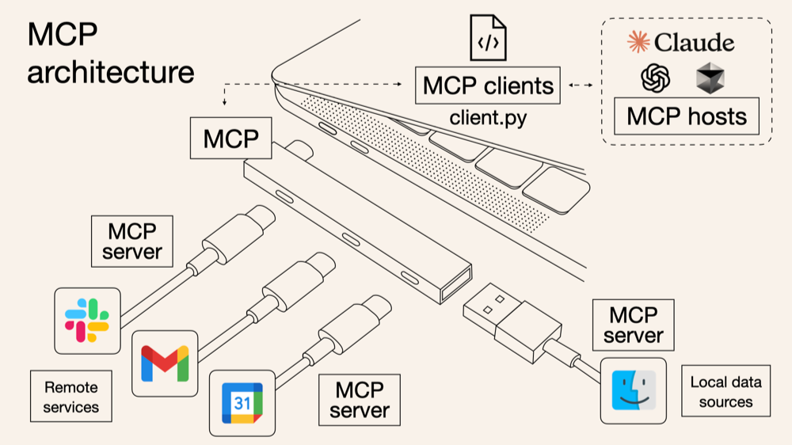

# Model Context Protocol Explained
|  | 
|:--:| 
| *The USB-C analogy of MCP (Image: [Norah Sakal](https://norahsakal.com/blog/mcp-vs-api-model-context-protocol-explained/))* |

In November 2024, Claude [announced the Model Context Protocol (MCP)](https://www.anthropic.com/news/model-context-protocol) to much fanfare in the AI and developer communities.

Today, I’ll attempt to explain MCP in simple terms for a diverse audience. By the end, you’ll understand not just what it does, but why it’s exciting. We’ll cover the basic components, how a request flows from an AI model to a tool, and wrap up with some novel usecases.

Learn more about me [here](about-me.md), or dive straight into the [presentation](presentation.md) and [use case example](example.md).
