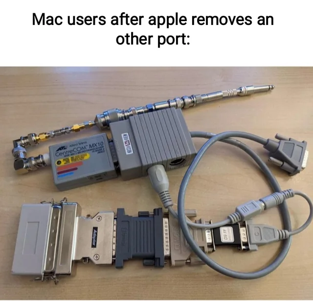
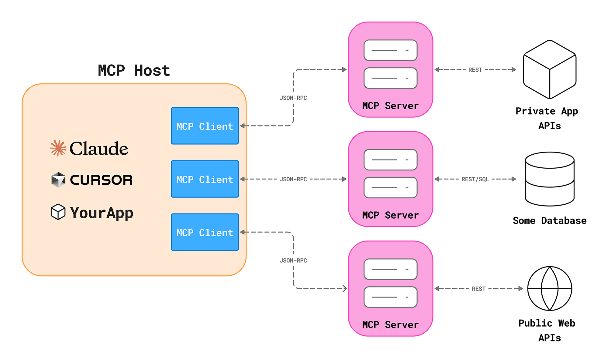

<script type="module">
  import mermaid from 'https://cdn.jsdelivr.net/npm/mermaid@10/dist/mermaid.esm.min.mjs';
  mermaid.initialize({ startOnLoad: true });
</script>


<style>
p > img { 
    display: block;           /* 🟨 Makes the image take its own line */
    margin-left: auto;        /* 🟨 Push image to center horizontally */
    margin-right: auto;       /* 🟨 Push image to center horizontally */
}
.mermaid {
    display: flex;              /* 🟨 Enable flexbox */
    justify-content: center;    /* 🟨 Center horizontally */
    align-items: center;        /* 🟨 Center vertically (optional) */
}
</style>


# How Does AI Talk to Its Tools?

> Explaining the Model Context Protocol (MCP) simply

---

|  |  |
|-------------------------|-------------------------|

---


---

## 🎯 The Core Idea
If you forget everything else, remember this:

> **Think of MCP as a universal docking station for LLMs to connect with its tools.**

---

# Understanding MCP

- Released in 2024 by Anthropic; quickly adopted by the community
- It is an open-source standard for connecting AI applications (Claude, ChatGPT) to external systems.
- External systems include:
    - tools (e.g. Gmail, slack, etc)
    - data sources (e.g. local files, databases)
    - workflows (e.g. specialized prompts)
- Goal: enabling them to access key information and perform specialized tasks.

---

## Before MCP

Modern AI tools often act in isolation — each with their own APIs and context limits.  

<div class="mermaid">
sequenceDiagram
    participant Model
    participant ToolA
    participant ToolB
    Model->>ToolA: Custom API call for Tool A (different format)
    Model->>ToolB: Custom API call for Tool B (different format)
</div>

---

## After MCP

<div class="mermaid">
sequenceDiagram
    participant Model
    participant MCP
    participant Tool1
    participant Tool2
    Model->>MCP: Standardized request
    MCP->>Tool1: Invoke Tool1
    MCP->>Tool2: Invoke Tool2
    Tool1-->>MCP: Response
    Tool2-->>MCP: Response
    MCP-->>Model: Standardized response
</div>

---

## MCP Architecture: Client & Server

> MCP has three main components: **Host (LLM)**, **Client**, and **Server (Tool)**.  

---

| | 
|:--:| 
| *MCP Architecture (Image: [Kashish Hora](https://mcpcat.io/blog/mcp-server-client-host/))* | 

---

## Concrete Example: Setting a Reminder

> Imagine your AI wants to set a reminder for you via Google Calendar.

<div class="mermaid">
sequenceDiagram
    participant User
    participant LLM
    participant MCPClient
    participant MCPServer
    participant GCalendar
    User->>LLM: "Set a reminder for 10 AM tomorrow"
</div>

---

## Concrete Example: Setting a Reminder

> Imagine your AI wants to set a reminder for you via Google Calendar.

<div class="mermaid">
sequenceDiagram
    participant User
    participant LLM
    participant MCPClient
    participant MCPServer
    participant GCalendar
    User->>LLM: "Set a reminder for 10 AM tomorrow"
    LLM->>MCPClient: Ask what tools are available
</div>

---

## Concrete Example: Setting a Reminder

> Imagine your AI wants to set a reminder for you via Google Calendar.

<div class="mermaid">
sequenceDiagram
    participant User
    participant LLM
    participant MCPClient
    participant MCPServer
    participant GCalendar
    User->>LLM: "Set a reminder for 10 AM tomorrow"
    LLM->>MCPClient: Ask what tools are available
    MCPClient->>MCPServer: get_capabilities
</div>

---

## Concrete Example: Setting a Reminder

> Imagine your AI wants to set a reminder for you via Google Calendar.

<div class="mermaid">
sequenceDiagram
    participant User
    participant LLM
    participant MCPClient
    participant MCPServer
    participant GCalendar
    User->>LLM: "Set a reminder for 10 AM tomorrow"
    LLM->>MCPClient: Ask what tools are available
    MCPClient->>MCPServer: get_capabilities
    MCPServer-->>MCPClient: List of tools (e.g. create_event)
</div>

---

## Example: Tool List and Metadata

```json
{
  "tools": [
    {
      "name": "create_event",
      "description": "Creates a new event in Google Calendar.",
      "input_schema": {
        "type": "object",
        "properties": {
          "title": { "type": "string", "description": "Event title" },
          "time": { "type": "string", "description": "Start time (ISO 8601)" },
          "duration": { "type": "string", "description": "Duration of the event" },
          "location": { "type": "string", "description": "Optional event location" }
        },
        "required": ["title", "time"]
      }
    },
    {
      "name": "delete_event",
      "description": "Deletes an event by ID from Google Calendar.",
      "input_schema": {
        "type": "object",
        "properties": {
          "event_id": { "type": "string", "description": "Unique identifier of the event" }
        },
        "required": ["event_id"]
      }
    }
  ]
}
```

---

## Concrete Example: Setting a Reminder

> Imagine your AI wants to set a reminder for you via Google Calendar.

<div class="mermaid">
sequenceDiagram
    participant User
    participant LLM
    participant MCPClient
    participant MCPServer
    participant GCalendar
    User->>LLM: "Set a reminder for 10 AM tomorrow"
    LLM->>MCPClient: Ask what tools are available
    MCPClient->>MCPServer: get_capabilities
    MCPServer-->>MCPClient: List of tools (e.g. create_event)
    MCPClient-->>LLM: Tool metadata returned
</div>

---

## Concrete Example: Setting a Reminder

> Imagine your AI wants to set a reminder for you via Google Calendar.

<div class="mermaid">
sequenceDiagram
    participant User
    participant LLM
    participant MCPClient
    participant MCPServer
    participant GCalendar
    User->>LLM: "Set a reminder for 10 AM tomorrow"
    LLM->>MCPClient: Ask what tools are available
    MCPClient->>MCPServer: get_capabilities
    MCPServer-->>MCPClient: List of tools (e.g. create_event)
    MCPClient-->>LLM: Tool metadata returned
    LLM->>MCPClient: Generate MCP request (invoke create_event)
</div>

---

## Concrete Example: Setting a Reminder

> Imagine your AI wants to set a reminder for you via Google Calendar.

<div class="mermaid">
sequenceDiagram
    participant User
    participant LLM
    participant MCPClient
    participant MCPServer
    participant GCalendar
    User->>LLM: "Set a reminder for 10 AM tomorrow"
    LLM->>MCPClient: Ask what tools are available
    MCPClient->>MCPServer: get_capabilities
    MCPServer-->>MCPClient: List of tools (e.g. create_event)
    MCPClient-->>LLM: Tool metadata returned
    LLM->>MCPClient: Generate MCP request (invoke create_event)
    MCPClient->>MCPServer: create_event request (time: 10 AM, title: reminder)
</div>

---

## Concrete Example: Setting a Reminder

> Imagine your AI wants to set a reminder for you via Google Calendar.

<div class="mermaid">
sequenceDiagram
    participant User
    participant LLM
    participant MCPClient
    participant MCPServer
    participant GCalendar
    User->>LLM: "Set a reminder for 10 AM tomorrow"
    LLM->>MCPClient: Ask what tools are available
    MCPClient->>MCPServer: get_capabilities
    MCPServer-->>MCPClient: List of tools (e.g. create_event)
    MCPClient-->>LLM: Tool metadata returned
    LLM->>MCPClient: Generate MCP request (invoke create_event)
    MCPClient->>MCPServer: create_event request (time: 10 AM, title: reminder)
    MCPServer->>GCalendar: Execute create event
</div>

---

## Concrete Example: Setting a Reminder

> Imagine your AI wants to set a reminder for you via Google Calendar.

<div class="mermaid">
sequenceDiagram
    participant User
    participant LLM
    participant MCPClient
    participant MCPServer
    participant GCalendar
    User->>LLM: "Set a reminder for 10 AM tomorrow"
    LLM->>MCPClient: Ask what tools are available
    MCPClient->>MCPServer: get_capabilities
    MCPServer-->>MCPClient: List of tools (e.g. create_event)
    MCPClient-->>LLM: Tool metadata returned
    LLM->>MCPClient: Generate MCP request (invoke create_event)
    MCPClient->>MCPServer: create_event request (time: 10 AM, title: reminder)
    MCPServer->>GCalendar: Execute create event
    GCalendar-->>MCPServer: Event created
</div>

---

## Concrete Example: Setting a Reminder

> Imagine your AI wants to set a reminder for you via Google Calendar.

<div class="mermaid">
sequenceDiagram
    participant User
    participant LLM
    participant MCPClient
    participant MCPServer
    participant GCalendar
    User->>LLM: "Set a reminder for 10 AM tomorrow"
    LLM->>MCPClient: Ask what tools are available
    MCPClient->>MCPServer: get_capabilities
    MCPServer-->>MCPClient: List of tools (e.g. create_event)
    MCPClient-->>LLM: Tool metadata returned
    LLM->>MCPClient: Generate MCP request (invoke create_event)
    MCPClient->>MCPServer: create_event request (time: 10 AM, title: reminder)
    MCPServer->>GCalendar: Execute create event
    GCalendar-->>MCPServer: Event created
    MCPServer->>MCPClient: Success response
</div>

---

## Concrete Example: Setting a Reminder

> Imagine your AI wants to set a reminder for you via Google Calendar.

<div class="mermaid">
sequenceDiagram
    participant User
    participant LLM
    participant MCPClient
    participant MCPServer
    participant GCalendar
    User->>LLM: "Set a reminder for 10 AM tomorrow"
    LLM->>MCPClient: Ask what tools are available
    MCPClient->>MCPServer: get_capabilities
    MCPServer-->>MCPClient: List of tools (e.g. create_event)
    MCPClient-->>LLM: Tool metadata returned
    LLM->>MCPClient: Generate MCP request (invoke create_event)
    MCPClient->>MCPServer: create_event request (time: 10 AM, title: reminder)
    MCPServer->>GCalendar: Execute create event
    GCalendar-->>MCPServer: Event created
    MCPServer->>MCPClient: Success response
    MCPClient->>LLM: Return structured result
</div>

---

## Concrete Example: Setting a Reminder

> Imagine your AI wants to set a reminder for you via Google Calendar.

<div class="mermaid">
sequenceDiagram
    participant User
    participant LLM
    participant MCPClient
    participant MCPServer
    participant GCalendar
    User->>LLM: "Set a reminder for 10 AM tomorrow"
    LLM->>MCPClient: Ask what tools are available
    MCPClient->>MCPServer: get_capabilities
    MCPServer-->>MCPClient: List of tools (e.g. create_event)
    MCPClient-->>LLM: Tool metadata returned
    LLM->>MCPClient: Generate MCP request (invoke create_event)
    MCPClient->>MCPServer: create_event request (time: 10 AM, title: reminder)
    MCPServer->>GCalendar: Execute create event
    GCalendar-->>MCPServer: Event created
    MCPServer->>MCPClient: Success response
    MCPClient->>LLM: Return structured result
    LLM->>User: "Sure! Reminder set for 10 AM tomorrow :)"
</div>

---

## Why This Matters: Real-World Potential

| Use Case | How MCP Applies | MCP Components Involved |
|-----------|----------------|--------------------------|
| **🧠 Unified AI Workspace** | Connects tools like Notion, Slack, and Figma so your AI can summarize meetings, update project boards, and draft designs — all in one conversation. | Host (LLM) → MCP Client → Multi-tool MCP Servers |
| **🏙️ Smart City Dashboards** | City AIs can pull live data for city population, transportation, weather, and building systems to generate insights or alerts | Host (LLM) → MCP Client → Sensor + Closed sourced research/Gov DB MCP Servers |

---

## That's it for the presentation. What's next?

> If you're interested check out the full MCP flow in more detail with this [example](example), or head back to the [homepage](/ol-demo).
