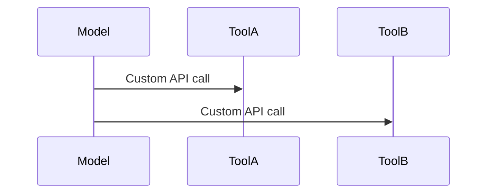
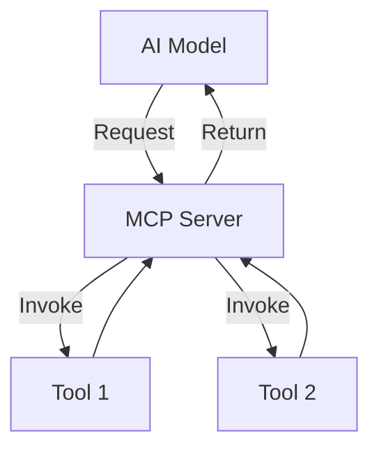

# How do AI Tools Talk to Each Other?

> Explaining the Model Context Protocol (MCP) simply

---

|  |  |
|-------------------------|-------------------------|

---


# Understanding MCP

> MCP is a protocol that allows AI models to communicate with external systems through standardized requests.

---


---

## 🎯 The Core Idea
If you forget everything else, remember this:

> **MCP is like a USB port for AI tools — any tool can plug in, communicate in a standard way, and work immediately.**

---

## 1️⃣ The Problem It Solves
Modern AI tools often act in isolation — each with their own APIs and context limits.  
This leads to duplication, inconsistency, and limited cooperation between systems.



Without a standard, every connection is a separate cable — fragile and error-prone.

## 2️⃣ The Core Concept

At its heart, MCP defines a shared protocol for models, tools, and clients.


> The MCP server acts as a universal connector, handling requests and responses in a standard format.

## 3️⃣ Analogy in Action
- **AI Model** = the device (e.g., laptop)  
- **MCP Server** = the USB hub / port  
- **Tools** = external devices (e.g., keyboard, mouse, hard drive)  

Every “plug in” request goes through the hub, ensuring devices communicate reliably.

---

## 4️⃣ What Makes MCP Different
| Feature | Traditional API | Model Context Protocol |
|----------|----------------|------------------------|
| Communication | One-to-one | Many-to-many |
| Context awareness | Local only | Shared and global |
| Extensibility | Manual integration | Automatic tool discovery |

---

## 5️⃣ Quick Example
```json
{
  "type": "request",
  "method": "get_weather",
  "params": {"city": "Singapore"}
}
```
- MCP interprets the request.
- Routes it to the correct tool.
- Merges the result back into the model’s context seamlessly.

## ✅ TL;DR
> MCP is like a **USB port for AI tools** — plug in any tool, communicate using a standard language, and it just works.

---

### Next Steps
- [A Concrete Example →](a-concrete-example.md)  
