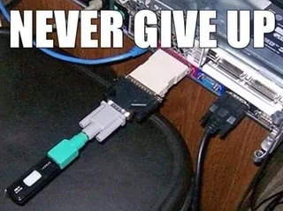
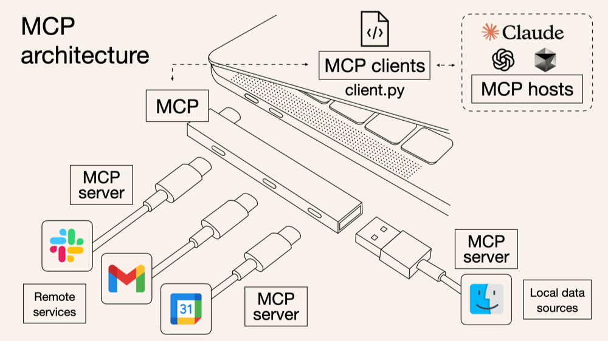

# How Does AI Talk to Its Tools?

> Explaining the Model Context Protocol (MCP) simply

---

|  |  |
|-------------------------|-------------------------|

---

---

## 🎯 The Core Idea
If you forget everything else, remember this:

> **Think of MCP as a universal docking station for AI models. It lets LLMs discover which tool (Gmail, Slack, Figma, etc) to use and  connect to it through a single, standardized protocol.**

---

# Understanding MCP

> MCP (Model Context Protocol) is an open-source standard for connecting AI applications to external systems. Using MCP, AI applications like Claude or ChatGPT can connect to data sources (e.g. local files, databases), tools (e.g. search engines, calculators) and workflows (e.g. specialized prompts)—enabling them to access key information and perform tasks.

---

## 1️⃣ The Problem
Modern AI tools often act in isolation — each with their own APIs and context limits.  

sequenceDiagram
    participant Model
    participant ToolA
    participant ToolB
    Model->>ToolA: Custom API call for Tool A (different format)
    Model->>ToolB: Custom API call for Tool B (different format)

---

## 2️⃣ How MCP Solves the Problem

At its heart, MCP defines a shared protocol for how large language models communicate with its tools

sequenceDiagram
    participant Model
    participant MCP
    participant Tool1
    participant Tool2
    Model->>MCP: Standardized request
    MCP->>Tool1: Invoke Tool1
    MCP->>Tool2: Invoke Tool2
    Tool1-->>MCP: Response
    Tool2-->>MCP: Response
    MCP-->>Model: Standardized response

---

## 3️⃣ MCP Architecture: Client & Server

> MCP has three main components: **Host (LLM)**, **Client**, and **Server (Tool)**.  

---

| | 
|:--:| 
| *MCP Architecture (Image: [Kashish Hora](https://mcpcat.io/blog/mcp-server-client-host/))* |

---

flowchart LR
    A[AI Model / Host] -->|Sends Intent| B[MCP Client]
    B -->|Standardized MCP Request| C[MCP Server]
    C -->|Executes Action| D[External Tool]
    D --> C
    C -->|Standardized Response| B
    B -->|Delivers Result| A

- **Host / Model**: Knows what it wants to do (e.g., send an email).  
- **Client**: Converts intent into an MCP request the server can understand.  
- **Server**: Executes the request on the tool and sends back a standard response.  

---

## 4️⃣ Concrete Example: Setting a Reminder

> Imagine your AI wants to set a reminder for you via Google Calendar.

sequenceDiagram
    participant User
    participant Host
    participant Client
    participant Server
    participant GCalendar
    User->>Host: "Set a reminder for 10 AM tomorrow"
    Host->>Client: Ask what tools are available
    Client->>Server: get_capabilities
    Server-->>Client: List of tools (e.g. create_event)
    Client-->>Host: Tool metadata returned
    Host->>Client: Generate MCP request (invoke create_event)
    Client->>Server: create_event request (time: 10 AM, title: reminder)
    Server->>GCalendar: Execute create event
    GCalendar-->>Server: Event created
    Server->>Client: Success response
    Client->>Host: Return structured result
    Host->>User: "Reminder set for 10 AM tomorrow."

---

## 5️⃣ Why This Matters: Product Use Cases

| Use Case | How MCP Applies | MCP Components Involved |
|----------|----------------|------------------------|
| **📩 Automating Email** | AI sends, schedules, or drafts emails through Gmail | Host (LLM) → Client → Gmail MCP Server |
| **📊 Generating Reports** | AI pulls data from multiple sources (Excel, Google Sheets, databases) and formats reports | Host → Client → Tool MCP Servers (Sheets, DBs) |
| **💬 Managing Chatbots** | AI coordinates multi-platform chatbots (Slack, WhatsApp, internal tools) seamlessly | Host → Client → Chat Platforms MCP Servers |

---

## 5️⃣ What's next?

> We’ll go into detail on [**email automation**](example), which demonstrates the full MCP flow in a simple example.
